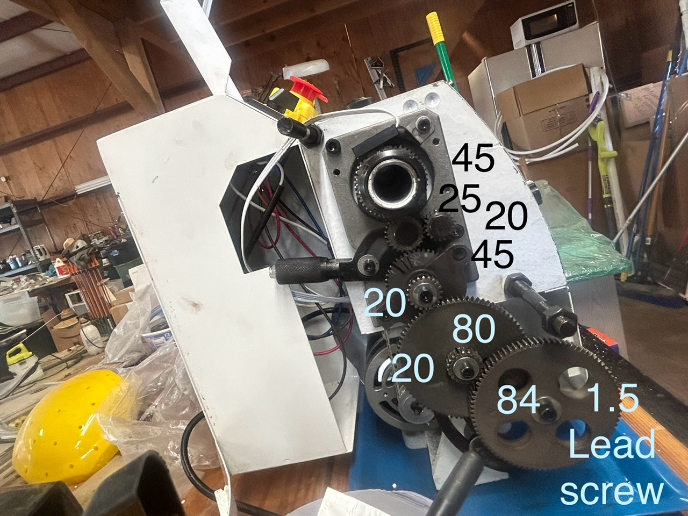
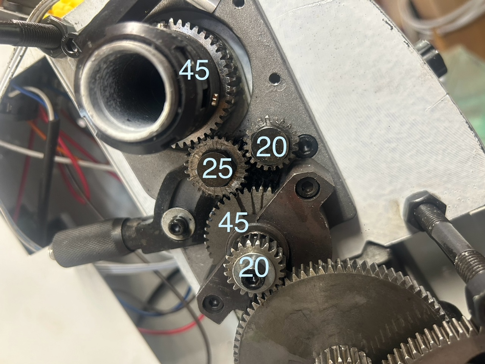
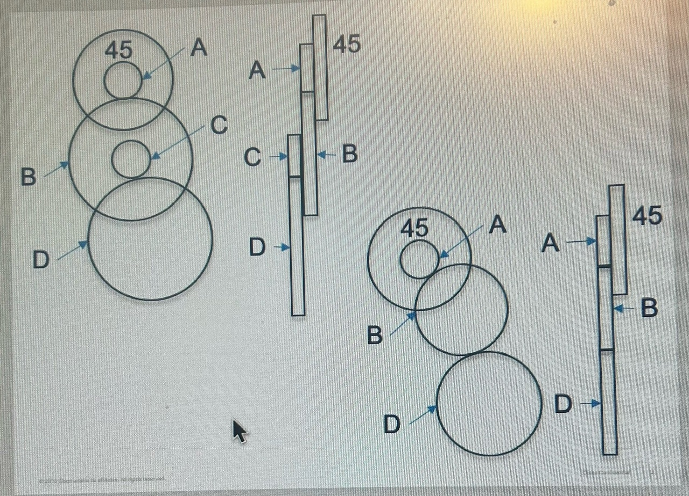
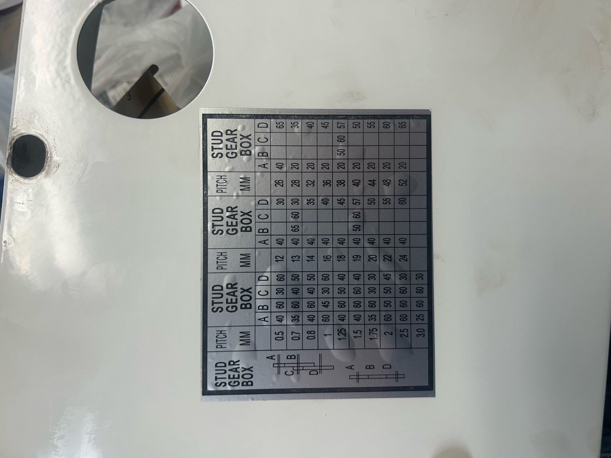

# Mini lathe arbritrary thread gearing calculator

On cheap mini lathes, for threading different pitches of gears, rather
than having a gearbox with some gear selector, one has to place
different gears on posts on the lathe to gear reduce from the lathe\'s
spindle onto the lead screw that moves the carriage side to side.

JSMNCC8X140000002V1 - VEVOR Mini Metal Lathe, 8"x14",
Mini Lathe Machine 2250 PRM Variable Speed Change, Precision Mini Lathe 650W Metal Working Lathe

The Gears on this lathe are set up differently and only have 4 gears that can be changed.
The Lead Screw is Gear D in the Thread Cutting Tables on the Lathe is gears_used[0] in the gear_ratio formula
Gear C = gears_used[1], etc. up to Gear A = gears_used[3]

     +==+
     |33|
 ====|AA|==Intermediate Post 2 = Spindle Speed
     |33|
     +==+
     |22|
     |22|
  +--+22|
  |11|22|
 =|CC|BB|==Intermediate Post 1
  |11|22|
  +==+22|
  |00|22|
  |00|22|
  |00+--+
  |00|
 =|DD|==Lead screw
  |00|
  |00|
  |00|
  |00|
  +==+

To use this program with this lathe the gear_ratio formula needs to change.
Gear A is set up to follow the splindle speed
Gear A is attached to a shaft that has a 45 tooth gear connected via the reverse control to the spindles 45 tooth gear
since Input# teath = Output # of teath the gear ratio is 1 and we don't have to consider this in our gear_ratio formula

The % speed reduction from Gear A to Gear B is Gear A/Gear B or gears_used[3]/gears_used[2]
Likewise the % speed reduction from Gear C to Gear D is Gear C/Gear D or  gears_used[1]/ gears_used[0]
Since this is a compond gear with Post 1 shared by Gear C and Gear B the two ratios are multiplied resulting in gear_ration formula below

gear_ratio = gears_used[3]/gears_used[2]*gears_used[1]/gears_used[0]

My Vevor mini lathe came with a table printed on the cover showing
which gears to place on which post to configure the lathe for common
Metric and Imperial thread pitches. However, these listed gears that
the lathe did not come with. So I set out to work out a combination
for the pitch I wanted that used gears that I have. I made a
spreadsheet that calculated the gear ratios to try them out. To ensure
my calculations were correct, I entered the provided threading
table. But my values disagreed. After much investigation, I realized
the included threading table was very inaccurate, to the point of
being practically useless for imperial threads.\

# Trying all gear combinations

**Watch my video about this: <https://youtu.be/sYw7OfeC1b8>**

To figure out what the *best* gears are for different pitches, I
figured its best to just try all gear combinations with a computer
program.

And this is why I wrote the python script **lathe_thread_gears.py**

This is a python script that is run from the command line.

Configuration for the script, such as which gears you have, metric or
imperial, and target thread pitches are parameters at the top of the
script. Modify these values to configure it. If your lathe has only
four gears that you can swap, you will have to modify the code in the
script also.

Output from the program looks like this:

Gear threading table, Lead screw gear first, gear engaging spindle last
'E=' indicates % error from target pitch value

  9.9818,  35,   50, 48,   57,  E=-0.182%
-------- 10 tpi --------
 10.0013,  54,   80, 35,   40,  E= 0.013%

 10.9994,  40,   54, 57,   65,  E=-0.005%
-------- 11 tpi --------
 11.0028,  80,   57, 25,   54,  E= 0.025%

 11.9770,  50,   54, 55,   72,  E=-0.192%
-------- 12 tpi --------
 12.0073,  65,   80, 48,   55,  E= 0.061%

 12.9993,  40,   54, 57,   55,  E=-0.005%
-------- 13 tpi --------
 13.0048,  48,   50, 20,   25,  E= 0.037%

 13.9959,  45,   35, 54,   84,  E=-0.029%
-------- 14 tpi --------
 14.0004,  54,   57, 48,   55,  E= 0.003%

 15.9657,  30,   50, 55,   35,  E=-0.214%
-------- 16 tpi --------
 16.0020,  84,   80, 54,   60,  E= 0.012%

 17.9701,  48,   84, 65,   35,  E=-0.166%
-------- 18 tpi --------
 18.0066,  72,   65, 48,   50,  E= 0.037%

 19.9635,  35,   57, 48,   25,  E=-0.183%
-------- 20 tpi --------
 20.0025,  84,   80, 54,   48,  E= 0.013%

 23.9562,  84,   50, 48,   57,  E=-0.183%
-------- 24 tpi --------
 24.0030,  84,   80, 54,   40,  E= 0.013%

 26.9551,  65,   35, 72,   84,  E=-0.166%
-------- 27 tpi --------
 27.0100,  54,   65, 48,   25,  E= 0.037%

 27.9534,  48,   54, 65,   35,  E=-0.166%
-------- 28 tpi --------
 28.0100,  60,   57, 55,   35,  E= 0.036%

 31.9314,  48,   35, 55,   40,  E=-0.214%
-------- 32 tpi --------
 32.0040,  84,   80, 72,   40,  E= 0.012%

 39.9270,  72,   45, 84,   57,  E=-0.183%
-------- 40 tpi --------
 40.0050,  84,   80, 45,   20,  E= 0.013%

 43.9012,  80,   20, 35,   54,  E=-0.225%
-------- 44 tpi --------
 44.0267,  84,   60, 65,   35,  E= 0.061%

Total gear combinations (including duplicates): 35366
Total gear ratios: 3342

This indicates:

|                           |            |                                   |
|---------------------------|------------|-----------------------------------|
| Actual pitch generated    | 12.9352    | TPI |
| Gear on end of lead screw | 20         | teeth |
| Bottom movable post gears | Any,Any    | Only one gear on this post, doesn\'t gear up or down so any tooth count will work. |
| Top movable post gears    | 24, 66     | 24 tooth gear engages with gears below 66 tooth gear engages with the spindle gear |
| Error                     | E=-0.498%  | The pitch is 4.98% smaller than targeted. |

The script prints the best combination it can find on either side of the
target gear ratios. It omits gear combinations that:

* Would cause interference between gears
* Would not reach the spindle
* Would not fit on the tilt-able mounting bar
* Would not allow the housing to be closed

However, the checks are rudimentary so just because it passed a
combination as valid, doesn\'t guarantee that it will fit. Your lathe
may of course have a different geometry from my Vevor mini lathe, so
the criteria may need adapting to your lathe.

The program is command line based and written in Python. Some
familiarity with the command line and Python *are* necessary to use
this script.

For those who insist on a "license" for this script, consider it GPL v2
licensed.  Won't include the file here, its ridiculous to have a license
bigger than the program!
